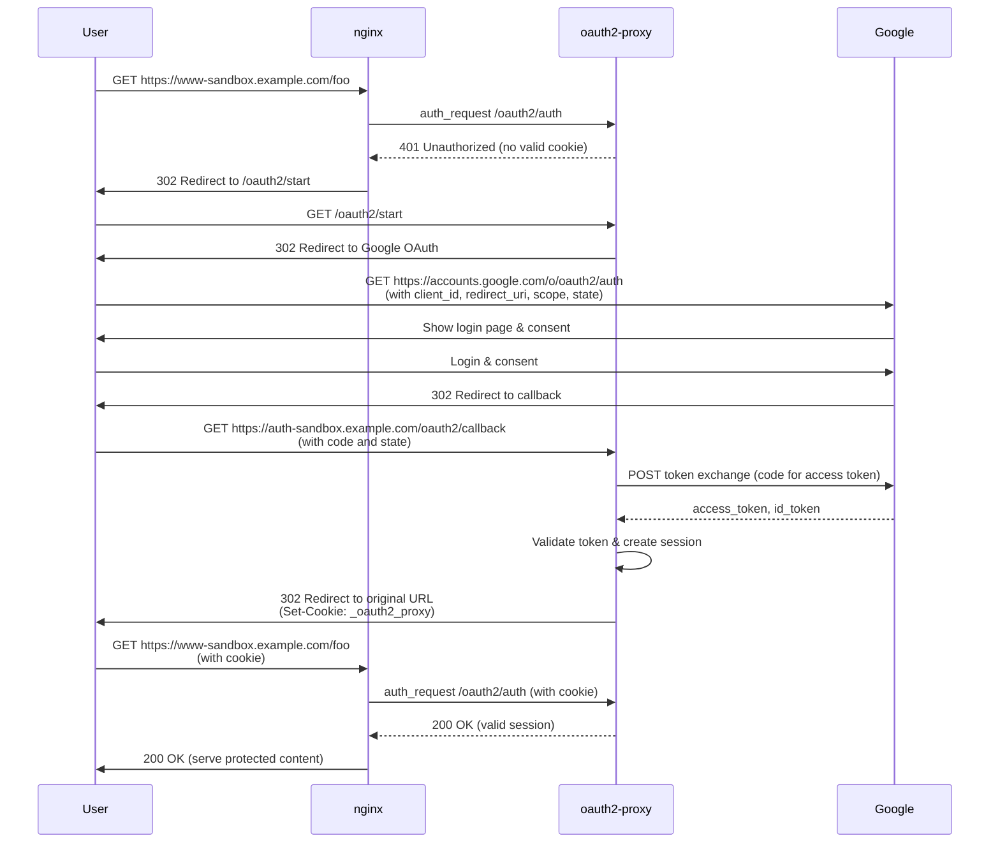

# hello-oauth2-proxy

This is an example config with oauth2-proxy and nginx for a wildcard domain.

## Request flow

### URL Examples

- `https://www-sandbox.example.com/foo`
- `https://accounts.google.com/o/oauth2/auth?access_type=offline&client_id=***&prompt=+&redirect_uri=https%3A%2F%2Fauth-sandbox.example.com%2Foauth2%2Fcallback&response_type=code&scope=profile+email&state=***%3Ahttp%3A%2F%2Fwww-sandbox.example.com%2Ffoo`
- `https://auth-sandbox.example.com/oauth2/callback?state=***%3Ahttp%3A%2F%2Fwww-sandbox.example.com%2Ffoo&code=***&scope=email+profile+https%3A%2F%2Fwww.googleapis.com%2Fauth%2Fuserinfo.email+https%3A%2F%2Fwww.googleapis.com%2Fauth%2Fuserinfo.profile+openid&authuser=0&prompt=none`
- `http://www-sandbox.example.com/foo`
- `https://www-sandbox.example.com/foo`
